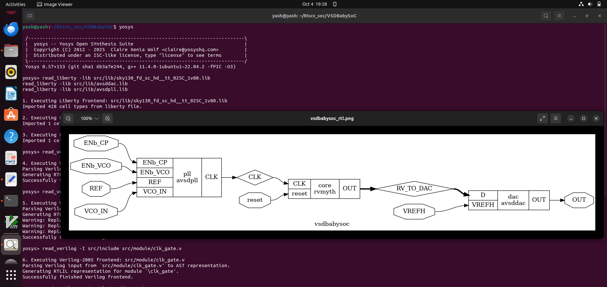
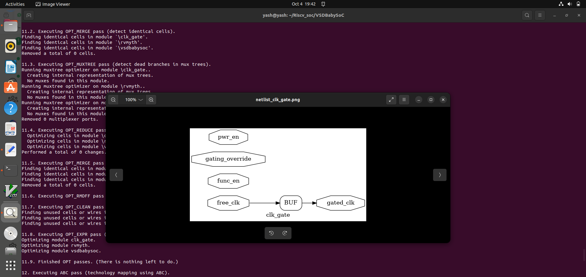
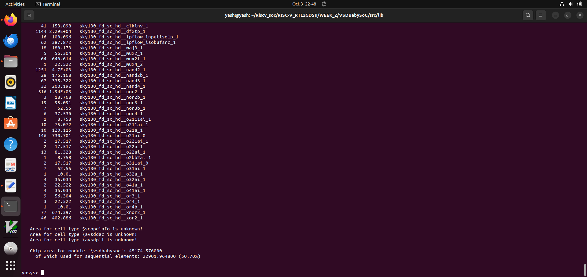
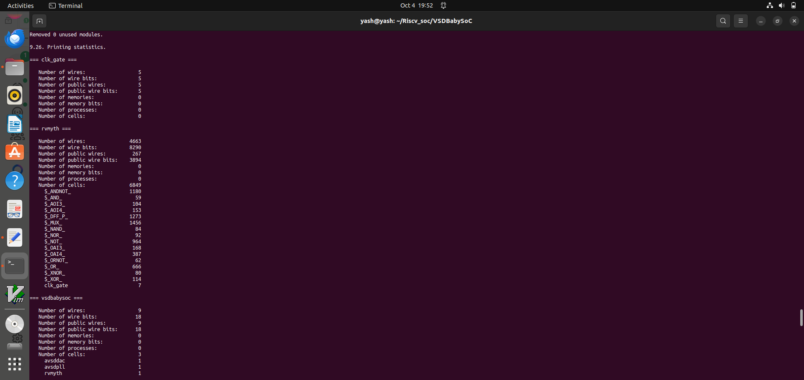
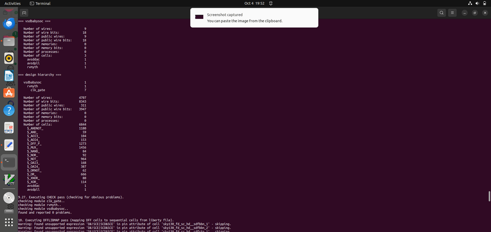
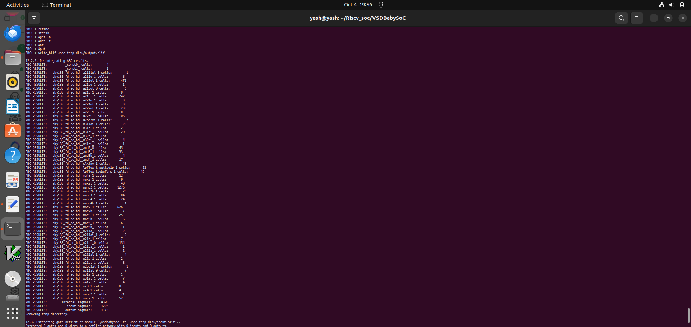
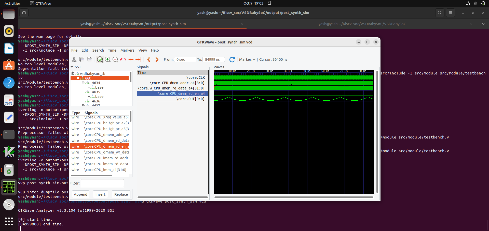
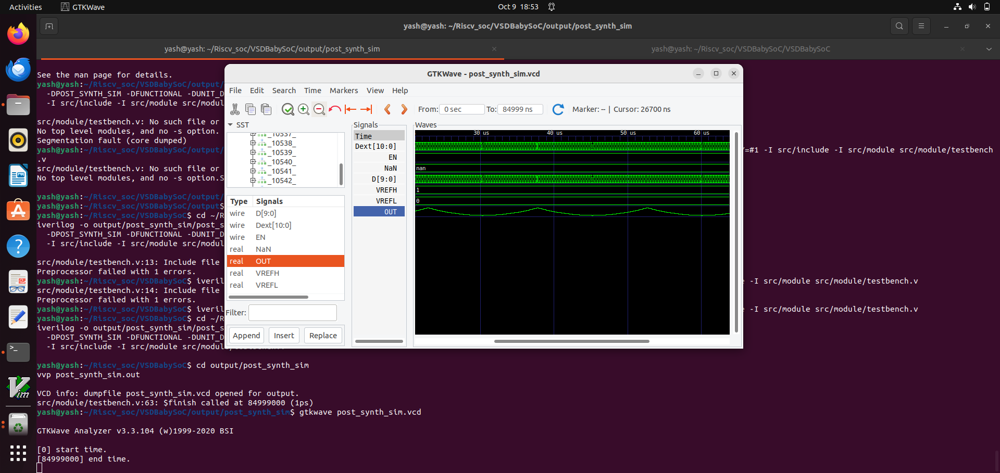
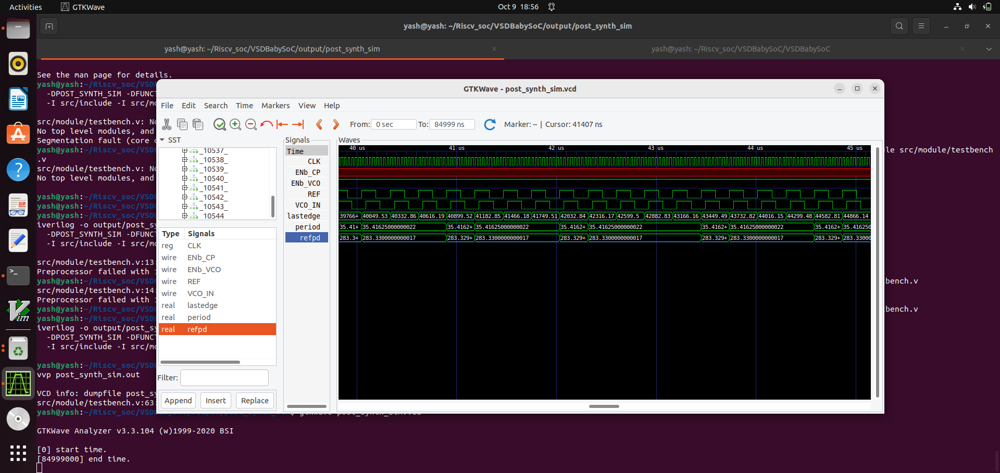

# 📘 Week 3 Task 1 - Post-Synthesis GLS & STA Fundamentals

## 🎯 Objective
To understand and perform **Gate-Level Simulation (GLS)** after synthesis, validate the functionality of the synthesized design, and explore the fundamentals of **Static Timing Analysis (STA)** using **OpenSTA**.

---

## 🧩 Step 1 – Perform synthesis of the BabySoC design. 

## 🧠 Yosys Synthesis Flow for VSDBabySoC

Here we do an module level synthesis beacuse it is not possible to work with gate level synthesis.

### --- Part 1: Read Libraries and Design ---

```bash
read_liberty -lib src/lib/sky130_fd_sc_hd__tt_025C_1v80.lib
read_liberty -lib src/lib/avsddac.lib
read_liberty -lib src/lib/avsdpll.lib
read_verilog src/module/vsdbabysoc.v
read_verilog -I src/include src/module/rvmyth.v
read_verilog -I src/include src/module/clk_gate.v
read_verilog src/module/avsddac_stub.v
read_verilog src/module/avsdpll_stub.v
```

### --- Part 2: Show the MODULE-LEVEL (RTL) design BEFORE synthesis for vsdbabysoc ---

```bash
show -format png -prefix vsdbabysoc_rtl vsdbabysoc
```

###  --- Part 3: Synthesize the Design (while preserving module boundaries) ---

```bash
synth -top vsdbabysoc
dfflibmap -liberty src/lib/sky130_fd_sc_hd__tt_025C_1v80.lib
opt
abc -liberty src/lib/sky130_fd_sc_hd__tt_025C_1v80.lib
```
### --- Part 4: Generate Gate-Level PNGs for Sub-modules (BEFORE flattening) ---

```bash
show -format png -prefix netlist_clk_gate clk_gate
show -format png -prefix netlist_avsdpll_stub avsdpll_stub
show -format png -prefix netlist_avsddac_stub avsddac_stub
```

### --- Part 5: Flatten the Design and Final Cleanup ---

```bash
flatten
setundef -zero
clean -purge
rename -enumerate
```
### --- Part 5: Write Final (Flattened) Netlist and Statistics ---

```bash
write_verilog -noattr reports/vsdbabysoc_netlist.v
stat -liberty src/lib/sky130_fd_sc_hd__tt_025C_1v80.lib
```
---








## 🧩 Part 2 – Post-Synthesis GLS

### 🔍 Overview
Gate-Level Simulation (GLS) is used to verify the **functional correctness** of the synthesized netlist.  
It ensures that the logic functionality remains **unchanged** after synthesis and that the design behaves as expected under timing constraints.

### **Step 1: Compile the Testbench**
Run the following `iverilog` command to compile the testbench:
```bash
iverilog -o output/post_synth_sim/post_synth_sim.out   -DPOST_SYNTH_SIM -DFUNCTIONAL -DUNIT_DELAY=#1   -I src/include -I src/module src/module/testbench.v
```
---
### **Step 2: Navigate to the Post-Synthesis Simulation Output Directory**
```bash
cd output/post_synth_sim/
```
---
### **Step 3: Run the Simulation**

```bash
vvp post_synth_sim.out
```
### **Step 4: View the Waveforms in GTKWave**

```bash
gtkwave post_synth_sim.vcd
```
---





# Functional vs Gate-Level Simulation in Digital Design

## Overview

This project demonstrates that **Functional Simulation** and **Gate-Level Simulation (GLS)** produce the **same output** when testing a digital circuit. Both simulations validate the correctness of a design, but from different perspectives:

- **Functional Simulation** tests the **Register Transfer Level (RTL)** design — a high-level description of the logic.
- **Gate-Level Simulation (GLS)** tests the **post-synthesis netlist** — a detailed gate-level representation of the logic.

If both simulations yield the same results, it confirms that the synthesis process correctly translated the RTL into logic gates.

---

## Key Concepts

### 1. Functional Simulation

- Simulates the behavior of the **RTL code** (typically written in Verilog or VHDL).
- Fast and abstract — does not consider timing delays.
- Helps in verifying the logical correctness of the initial design.
- Acts as the **reference or golden model**.

### 2. Synthesis

- Converts RTL code into a **gate-level netlist** using logic synthesis tools (like Synopsys Design Compiler or Yosys).
- The netlist consists of actual logic gates (AND, OR, NOT, flip-flops, etc.) that implement the same functionality.

### 3. Gate-Level Simulation (GLS)

- Simulates the synthesized gate-level netlist.
- Can optionally include **timing information** for more realistic analysis.
- Verifies that the synthesis preserved the functional behavior of the RTL design.

---

## Why the Outputs Should Match

Functional and Gate-Level Simulations are essentially validating **two views of the same logic**:

- The **Functional Simulation** validates the intent of the designer.
- The **GLS** validates the implementation after synthesis.

If synthesis is performed correctly, both simulations should produce identical outputs. Any mismatch usually indicates:

- A problem in the synthesis process.
- Incorrect synthesis constraints or tool settings.
- A bug in the RTL that only shows up after synthesis.

---
