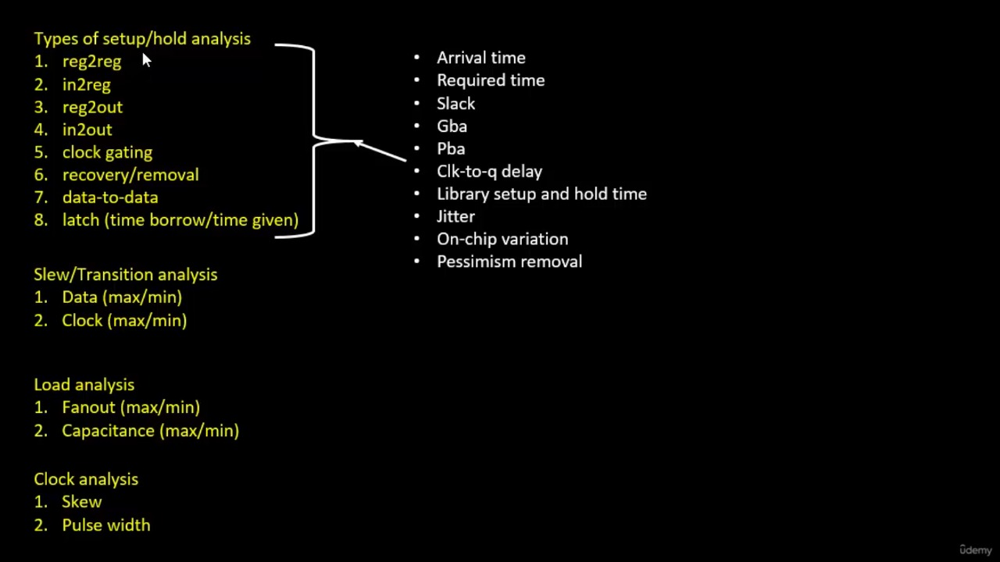
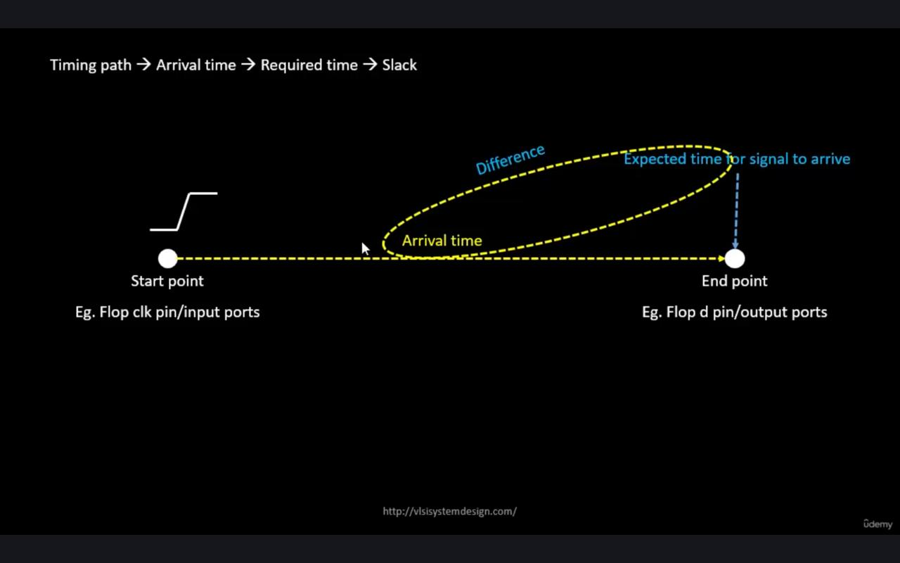
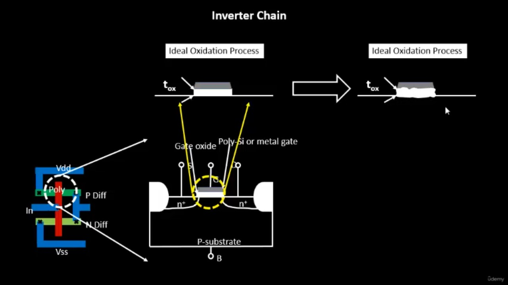
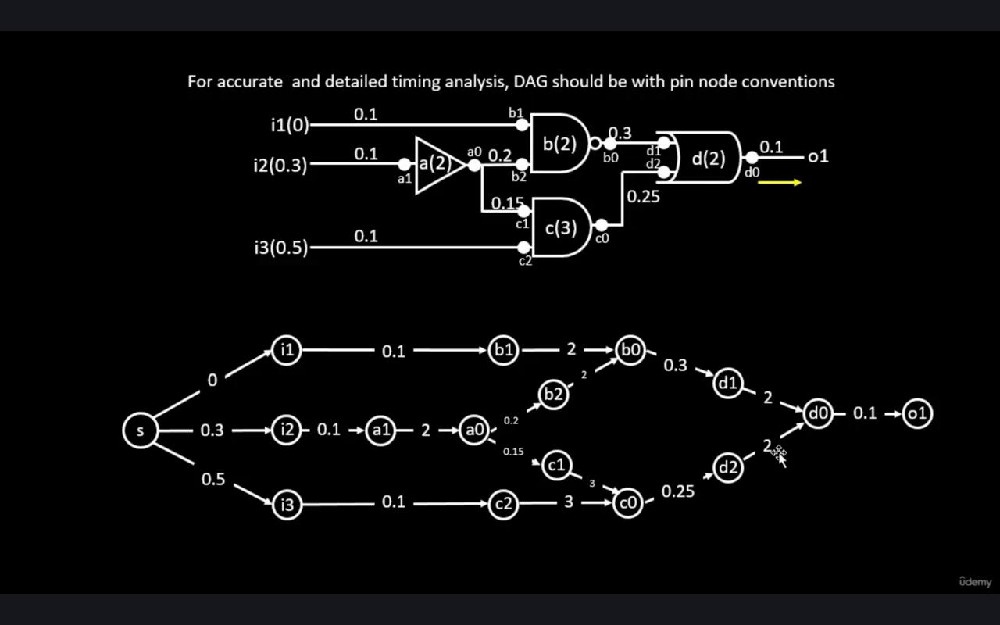
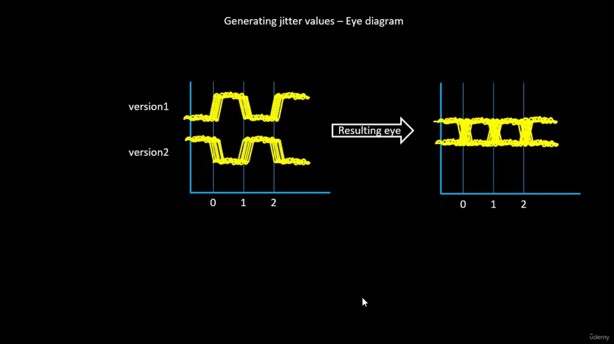

# ⚙️ Static Timing Analysis (STA) — Setup & Hold Path Types and Core Concepts

Static Timing Analysis (STA) ensures a digital circuit operates correctly at the intended clock frequency by checking **setup** and **hold time** constraints across all timing paths.  
This document explains various **timing path types**, **key STA metrics**, and **advanced analysis concepts** such as OCV, CRPR, and slew/load effects.

---

## 🧩 1. Types of Setup/Hold Analysis

### 🔁 1.1 Register-to-Register (reg2reg)
- Most critical and common STA path.  
- Starts from the **launch flip-flop clock pin** and ends at the **capture flip-flop data pin**.  
- Ensures data passes through combinational logic and arrives **within setup/hold constraints**.

---

### ⚙️ 1.2 Input-to-Register (in2reg)
- Path from a **primary input port** to the **data input of a register**.  
- Ensures external signals are captured correctly at the **first clock cycle**.

---

### 📤 1.3 Register-to-Output (reg2out)
- Starts from the **clock pin of the final flip-flop** and ends at a **primary output port**.  
- Determines how quickly valid data can be **driven off-chip** to other components.

---

### 🔄 1.4 Input-to-Output (in2out)
- A **purely combinational** or “feedthrough” path.  
- Data travels directly from an **input port** to an **output port**, without passing through any registers.

---

### 💡 1.5 Clock Gating Checks
- A **power optimization technique** that disables the clock for idle blocks.  
- STA verifies that the **enable signal** to the clock gate arrives at the correct time, preventing **glitches or short clock pulses**.

---

### 🧭 1.6 Recovery / Removal Checks
Applied to **asynchronous pins** like *reset* or *set* on flip-flops.

| Check | Description | Analogous To |
|--------|--------------|--------------|
| **Recovery Time** | Minimum time async signal must be **de-asserted before** next active clock edge | Setup Time |
| **Removal Time** | Minimum time async signal must remain **asserted after** the clock edge | Hold Time |

---

### ⚡ 1.7 Data-to-Data Checks
- Ensures **timing relationship** between two data signals.  
- Prevents **race conditions** and ensures **protocol correctness** in data-dependent designs.

---

### ⏳ 1.8 Latch Analysis (Time Borrow / Time Given)
- Latches are **level-sensitive**, not edge-triggered.  
- When data arrives late, it can **“borrow” time** from the next clock phase while the latch is still transparent.  
- STA must account for this **borrowed time** to verify correct timing.

---

## 📈 2. Key Metrics and Concepts in Path Analysis

### 🕓 Arrival Time (AT)
Time taken for a signal to travel from source to destination.

---

### ⏰ Required Time (RT)
Time by which data **must arrive** to meet timing requirements.

- **For Setup:**
Required Time = Capture Edge + Clock Path Delay (capture) - Tsetup

- **For Hold:**
Required Time = Capture Edge + Clock Path Delay (capture) + Thold

---

### 📊 Slack
Indicates **timing margin** between required and actual data arrival.

| Type | Formula | Interpretation |
|------|----------|----------------|
| **Setup Slack** | Required Time − Arrival Time | Measures if data is fast enough |
| **Hold Slack** | Arrival Time − Required Time | Measures if data isn’t too fast |

> ✅ **Positive Slack:** Timing met  
> ❌ **Negative Slack:** Timing violation

---

## 🧮 3. Analysis Algorithms

| Type | Description | Pros | Cons |
|------|--------------|------|------|
| **Graph-Based Analysis (GBA)** | Calculates timing at each node | Fast, efficient | Can be pessimistic |
| **Path-Based Analysis (PBA)** | Evaluates each unique path | Highly accurate | Slow, memory-heavy |

> 🔍 Typically, GBA identifies critical paths and PBA re-analyzes them for **final sign-off**.

---

## 🔩 4. Cell and Library Parameters

### ⏱️ Clk-to-Q Delay
- Delay from **active clock edge** to when valid data appears at **Q output** of a flip-flop.

### 📚 Library Setup / Hold Times
- Predefined timing constraints from the **technology library (.lib)** file.  
- Define the **timing window** where data must be stable around the clock edge.

---

## 🕧 5. Clock-Related Effects

### 📉 Jitter
- Random variations in clock edge arrival time.  
- Reduces available data travel time → must be considered in timing calculations.

---

### 🔀 On-Chip Variation (OCV)
Accounts for **PVT (Process, Voltage, Temperature)** variations across the chip.

- **Setup Check (worst-case):**
- Launch path → slowed  
- Capture path → sped up
- **Hold Check (worst-case):**
- Launch path → sped up  
- Capture path → slowed down

---

### 🧠 Clock Reconvergence Pessimism Removal (CRPR)
- During OCV analysis, **common clock segments** may be derated twice.  
- CRPR identifies these common paths and removes **artificial pessimism**, improving timing accuracy.

---

## ⚡ 6. Slew and Transition Analysis

### 🔼 Slew (Transition Time)
- Measures how fast a signal transitions between logic levels.  
- Affects gate delay and overall timing performance.

| Signal | Max/Min Check | Purpose |
|---------|----------------|----------|
| **Data** | Max: For setup (slow path)   Min: For integrity | Ensures proper data transition speed |
| **Clock** | Must be sharp (low slew) | Prevents uncertainty at capture |

---

## 🔌 7. Load Analysis

### 🌿 Fanout
- Number of gates driven by a single output.  
- Higher fanout → higher load → increased delay.

### ⚖️ Capacitance
- Total capacitive load on a gate output (includes wiring + driven gate inputs).  
- Analyzed under **max** (setup worst-case) and **min** (hold worst-case) conditions.

---

## 🕰️ 8. Clock Analysis

| Parameter | Description | Impact |
|------------|--------------|---------|
| **Skew** | Difference in clock arrival between flops | Affects setup/hold |
| **Positive Skew** | Capture clock arrives **later** | Helps setup, hurts hold |
| **Negative Skew** | Capture clock arrives **earlier** | Helps hold, hurts setup |
| **Pulse Width** | Minimum time clock stays high or low | Ensures valid clock operation |

---
# 🧠 Digital Design Fundamentals – Latches, MOSFETs, Timing Graphs & Jitter

## 📘 1. Negative and Positive Latches

### 🔹 Overview  
Latches are **level-sensitive memory elements** that store a single bit of data. Their operation depends on the **level (HIGH or LOW)** of the clock signal.

### ⚙️ Positive Latch (Transparent HIGH)
- **When CLK = HIGH:**  
  - Transmission gate **Tr3 ON**, **Tr4 OFF**  
  - Latch is **transparent** → Input data flows directly to output **Q**
- **When CLK = LOW:**  
  - **Tr3 OFF**, **Tr4 ON**  
  - Latch becomes **opaque**, and feedback (Inv4–Inv6) **holds** the last value at Q

### ⚙️ Negative Latch (Transparent LOW)
- **When CLK = LOW:**  
  - **Tr1 ON**, **Tr2 OFF** → Latch is transparent (D → Q)
- **When CLK = HIGH:**  
  - **Tr1 OFF**, **Tr2 ON** → Latch holds the last Q via feedback loop

> **Note:** Transmission gates (NMOS + PMOS in parallel) act as robust, bidirectional switches controlled by the clock and its complement.

---

## ⚡ 2. Inverter Chain & MOSFET Structure

### 🔹 MOSFET Structure  
- **Type:** NMOS (shown in the diagram)  
- **Substrate:** P-type with two N+ regions (source & drain)  
- **Gate Oxide:** Thin insulating layer (SiO₂) separating gate from substrate  
- **Operation:**  
  - Applying a **positive gate voltage** attracts electrons under the gate, forming a **conductive channel** → transistor turns **ON**

### 🧩 Ideal Oxidation Process  
- The **oxide layer thickness (tₒₓ)** is critical:
  - Thinner and uniform oxide → Better gate control → Faster switching  
  - Non-uniform or rough oxide → Poor transistor performance, higher delay, unreliable operation  

> 🏭 This process is a cornerstone of **semiconductor fabrication**, directly impacting transistor speed and reliability.

---

## 🕸️ 3. Directed Acyclic Graph (DAG) for Timing Analysis

### 🔹 What is a DAG?
A **Directed Acyclic Graph** is used to model digital circuits for **Static Timing Analysis (STA)**.

- **Nodes:** Represent logic gate pins (e.g., `a0`, `b1`, `c2`)  
- **Edges:** Represent timing relationships (gate delay or wire delay)

### 🧮 Timing Analysis with DAG
- Each edge has a **delay weight** (e.g., inverter delay = 2, wire delay = 0.1)  
- STA tools **traverse the graph** from input → output, summing delays  
- This helps find:
  - **Path Delay** – total propagation time  
  - **Critical Path** – slowest path limiting clock speed  

> ✅ No loops exist (acyclic), matching combinational logic behavior.

---

## ⏱️ 4. Jitter and the Eye Diagram

### 🔹 What is Jitter?
**Jitter** refers to small, random variations in signal edge timing from their ideal positions.  
In waveforms, these cause edges to **shift slightly forward or backward** in time.

### 👁️ Eye Diagram
An **eye diagram** is generated by **overlaying multiple signal cycles** to visualize timing stability.

### 🧭 Interpretation
- **Eye Opening:**  
  - Wide → Clean signal (low jitter, less noise) ✅  
- **Eye Closing:**  
  - Narrow → Poor signal (high jitter, timing errors) ❌  
- **Edge Thickness:**  
  - Thicker edges = Higher jitter (more edge uncertainty)

> 📉 A closed eye implies potential data sampling errors in high-speed systems.

---

## 🧩 Summary of Key Learnings
| Concept | Key Insight |
|----------|--------------|
| **Latches** | Level-sensitive elements storing data based on clock level |
| **MOSFET** | Gate oxide quality directly affects transistor performance |
| **DAG in STA** | Models timing dependencies without loops for accurate analysis |
| **Jitter & Eye Diagram** | Used to assess signal integrity in high-speed designs |
| **STA Goal** | Verify timing constraints (setup & hold) |
| **Critical Paths** | reg2reg, in2reg, reg2out, in2out |
| **Slack** | Key metric for timing margin |
| **OCV & CRPR** | Handle real-world variations accurately |
| **Slew / Load** | Affect gate delay and transition quality |
| **Clock Analysis** | Ensures stable and synchronized data capture |

---

## 🌟 Key Takeaways

- STA checks **every possible timing path** without full simulation.  
- Understanding **setup/hold, slack, and clock parameters** is essential for timing closure.  
- **GBA + PBA** combination gives balance between speed and accuracy.  
- Effects like **OCV, jitter, and CRPR** refine real-world chip behavior.  
- Proper **slew and load management** ensures robust circuit performance.

---

