# 📘 Week 3 Task 3-  Post-Synthesis GLS & STA Fundamentals

## 🎯 Objective
**Static Timing Analysis** is one of the many techniques available to verify the timing of a digital design. 

An alternate approach used to verify the timing is the timing simulation which can verify the functionality as well as the timing of the design. 

The term timing analysis is used to refer to either of these two methods - static timing analysis, or the timing simulation. 

Thus, timing analysis simply refers to the analysis of the design for timing issues.

The STA is static since the analysis of the design is carried out statically and does not depend upon the data values being applied at the input pins. 

---

## Installation of OpenSTA

**Note:** Installation instructions are adapted from the official OpenSTA repository:
🔗 https://github.com/parallaxsw/OpenSTA

#### Step 1: Clone the Repository

```bash
git clone https://github.com/parallaxsw/OpenSTA.git
cd OpenSTA
```

#### Step 2: Build the Docker Image
```bash
docker build --file Dockerfile.ubuntu22.04 --tag opensta .
```
This builds a Docker image named opensta using the provided Ubuntu 22.04 Dockerfile. All dependencies are installed during this step.

#### Step 3: Run the OpenSTA Container
To run a docker container using the OpenSTA image, use the -v option to docker to mount direcories with data to use and -i to run interactively.
```bash
docker run -i -v $HOME:/data opensta
```


You now have OpenSTA installed and running inside a Docker container. After successful installation, you will see the % prompt—this indicates that the OpenSTA interactive shell is ready for use.

## Timing Analysis Using Inline Commands
1️⃣ for ***nangate45_slow.lib.gz*** file
Once inside the OpenSTA shell (% prompt), you can perform a basic static timing analysis using the following inline commands:
```bash
read_liberty /OpenSTA/examples/nangate45_slow.lib.gz
read_verilog /OpenSTA/examples/example1.v
link_design top
create_clock -name clk -period 10 {clk1 clk2 clk3}
set_input_delay -clock clk 0 {in1 in2}
report_checks
```
_This flow is useful for quick testing and debugging without writing a full TCL script._

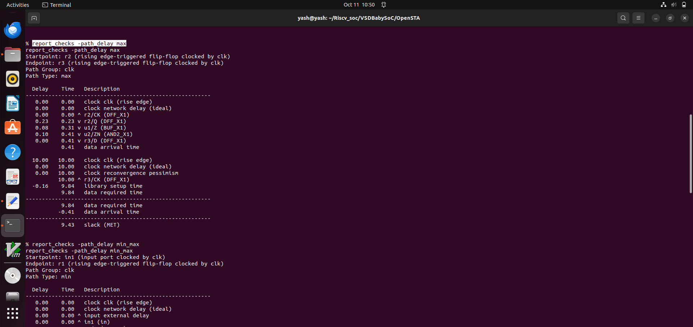
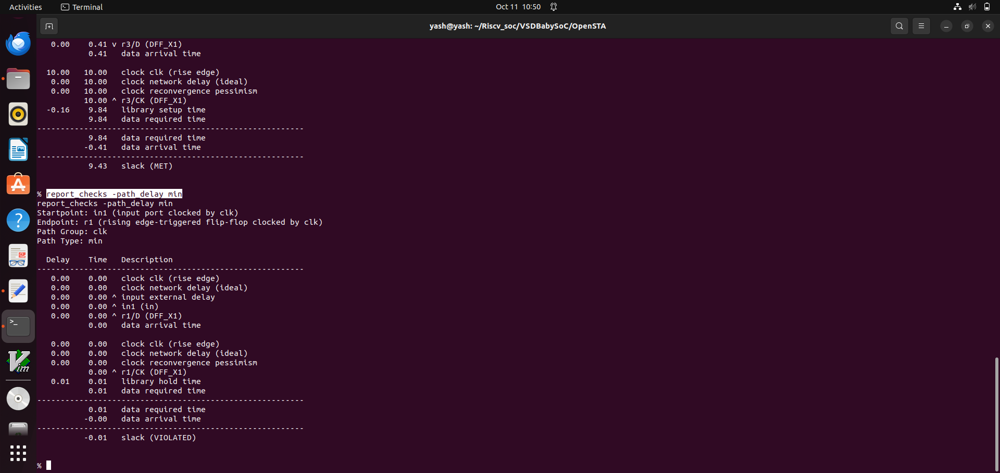

**Note:** We used report_checks here because only the slow liberty file (nangate45_slow.lib.gz) is loaded. 

This represents a setup (max delay) corner, so the analysis focuses on setup timing by default.

🤔**Why Does report_checks Show Only Max (Setup) Paths?**

By default, report_checks reports -path_delay max (i.e., setup checks).

OpenSTA interprets report_checks without arguments as:
```bash
report_checks -path_delay max
```
This reports only max path delays, i.e., setup timing checks.

✅**How to Also Get Hold (min) Paths:**

If you want both setup and hold timing checks (i.e., both max and min path delays), use:
```bash
report_checks -path_delay min_max
```
(Or) if you want to see only hold checks (min path delays):
```bash
report_checks -path_delay min
```
🛠️ Here are the commands for Yosys synthesis for example1.v run the following commends in the cd VSDbabysoc/opensta/examples this folder:
```bash
yosys
read_liberty -lib nangate45_slow.lib
read_verilog example1.v
synth -top top
show
```
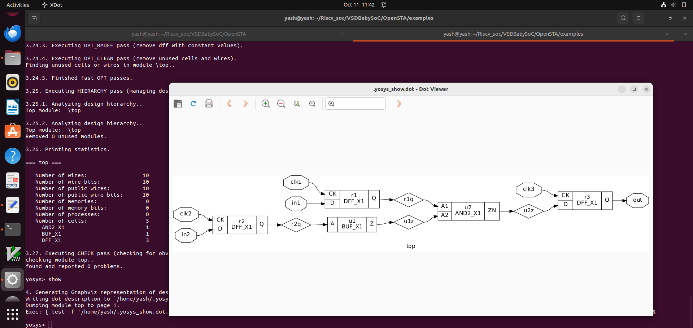

2️⃣ for ***nangate45_fast.lib.gz*** file
Once inside the OpenSTA shell (% prompt), you can perform a basic static timing analysis using the following inline commands:
```bash
read_liberty /OpenSTA/examples/nangate45_fast.lib.gz
read_verilog /OpenSTA/examples/example1.v
link_design top
create_clock -name clk -period 10 {clk1 clk2 clk3}
set_input_delay -clock clk 0 {in1 in2}
report_checks
report_checks -path_delay max
report_checks -path_delay min_max
report_checks -path_delay min
```
_This flow is useful for quick testing and debugging without writing a full TCL script._

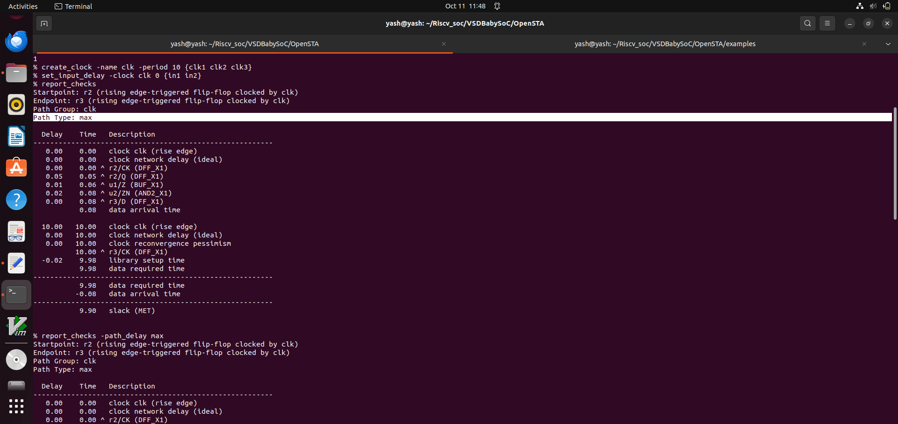
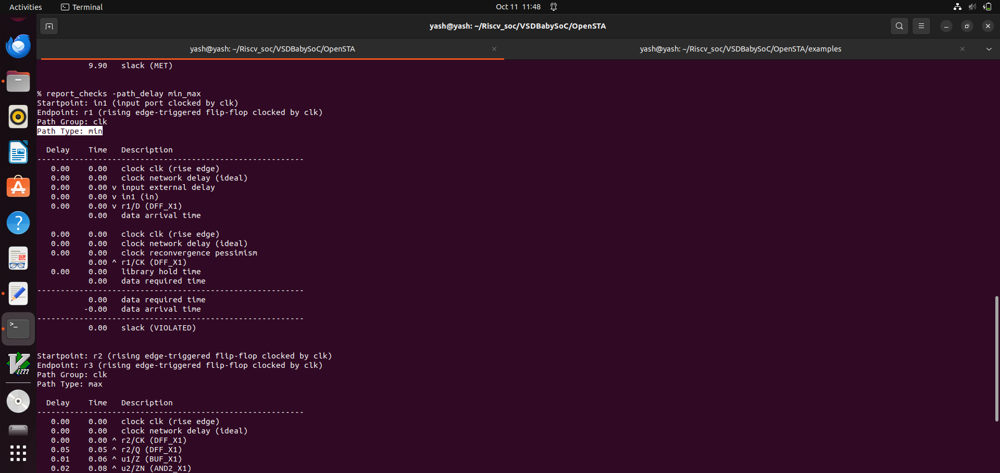


3️⃣ for ***nangate45_typ.lib.gz*** file
Once inside the OpenSTA shell (% prompt), you can perform a basic static timing analysis using the following inline commands:
```bash
read_liberty /OpenSTA/examples/nangate45_typ.lib.gz
read_verilog /OpenSTA/examples/example1.v
link_design top
create_clock -name clk -period 10 {clk1 clk2 clk3}
set_input_delay -clock clk 0 {in1 in2}
report_checks
report_checks -path_delay max
report_checks -path_delay min_max
report_checks -path_delay min
```
_This flow is useful for quick testing and debugging without writing a full TCL script._

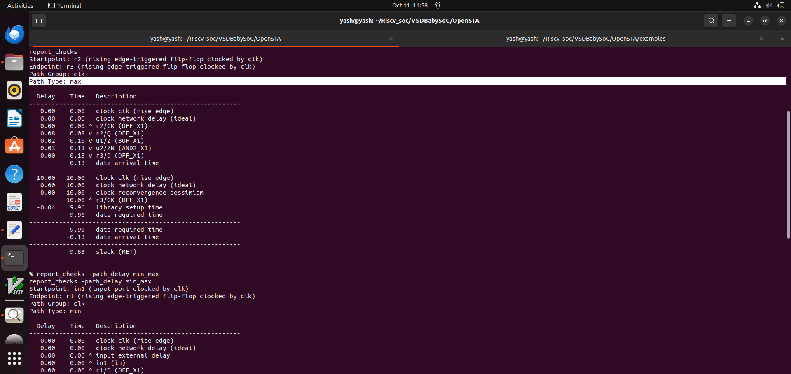
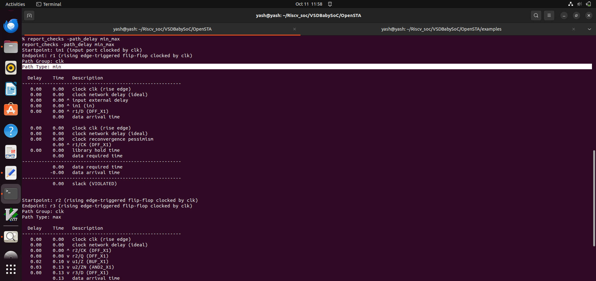

## SPEF-Based timing anylysis

Here’s the same OpenSTA timing analysis flow with added SPEF-based parasitic modeling:

This enables **more realistic delay and slack computation** by including post-layout RC data, improving timing signoff precision.

1️⃣ for ***nangate45_slow.lib.gz*** file
```shell
docker run -i -v $HOME:/data opensta
```
```shell
read_liberty /OpenSTA/examples/nangate45_slow.lib.gz
read_verilog /OpenSTA/examples/example1.v
link_design top
read_spef /OpenSTA/examples/example1.dspef
create_clock -name clk -period 10 {clk1 clk2 clk3}
set_input_delay -clock clk 0 {in1 in2}
report_checks
```
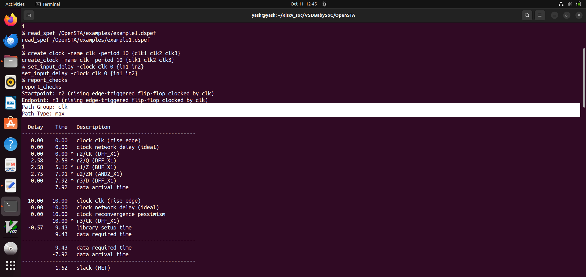

### more options to explore

**<ins>Report Capacitance per Stage</ins>**

Reports timing paths with 4-digit precision and shows the net capacitance at each stage, helping identify high-cap nodes that may affect delay.
```bash
report_checks -digits 4 -fields capacitance ## report capacitance per stage
```
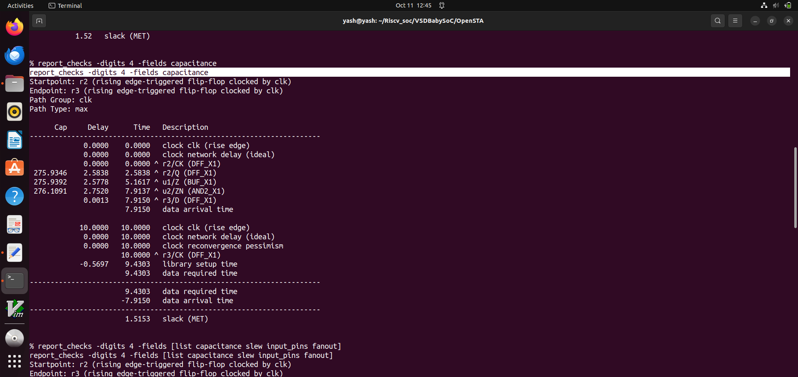

**<ins>Report Timing with Capacitance, Slew, Input Pins, and Fanout</ins>**

Report timing with capacitance, slew, input pins, and fanout per stage.
```bash
report_checks -digits 4 -fields [list capacitance slew input_pins fanout]       ###Report Timing with Capacitance, Slew, Input Pins, and Fanout
```
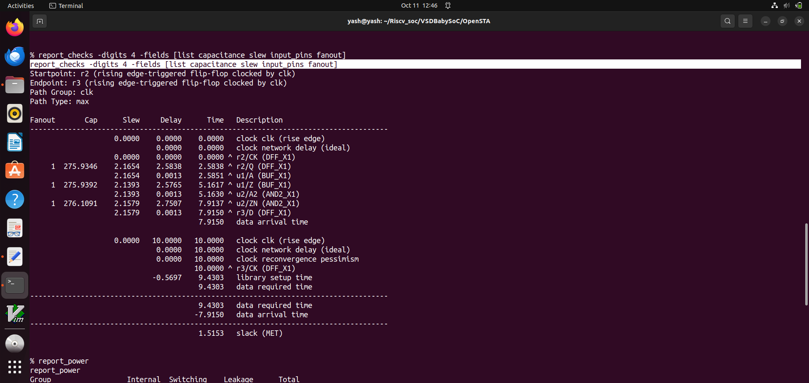

**<ins>Report Total and Component Power</ins>**

The report_power command uses static power analysis based on propagated or annotated pin activities in the circuit using Liberty power models. 

The internal, switching, leakage and total power are reported. 

Design power is reported separately for combinational, sequential, macro and pad groups. Power values are reported in watts.
```bash
report_power ### reort total and component power
```

**<ins>Report Pulse Width Checks</ins>**

The report_pulse_width_checks command reports min pulse width checks for pins in the clock network. 

If pins is not specified all clock network pins are reported.
```bash
report_pulse_width_checks ### report_pulse_width_check
```

**<ins>Report Units </ins>**

Report the units used for command arguments and reporting.
```bash
report_units  ### report_units
```


2️⃣ for ***nangate45_fast.lib.gz*** file
```shell
docker run -i -v $HOME:/data opensta
```
```shell
read_liberty /OpenSTA/examples/nangate45_fast.lib.gz
read_verilog /OpenSTA/examples/example1.v
link_design top
read_spef /OpenSTA/examples/example1.dspef
create_clock -name clk -period 10 {clk1 clk2 clk3}
set_input_delay -clock clk 0 {in1 in2}
report_checks
```
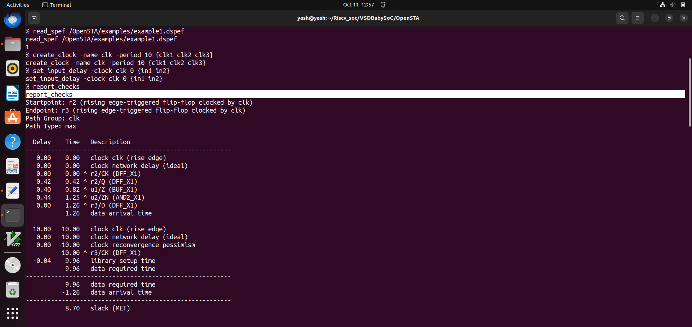

### more options to explore

```bash
report_checks -digits 4 -fields capacitance ## report capacitance per stage
report_checks -digits 4 -fields [list capacitance slew input_pins fanout]       ###Report Timing with Capacitance, Slew, Input Pins, and Fanout
report_power ### reort total and component power
report_pulse_width_checks ### report_pulse_width_check
report_units  ### report_units
```
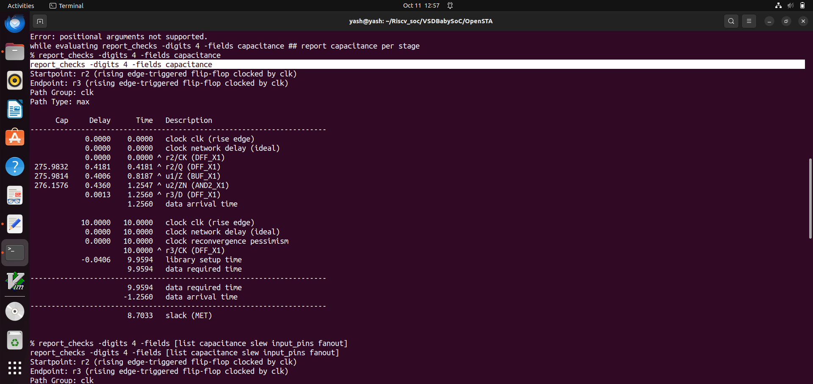
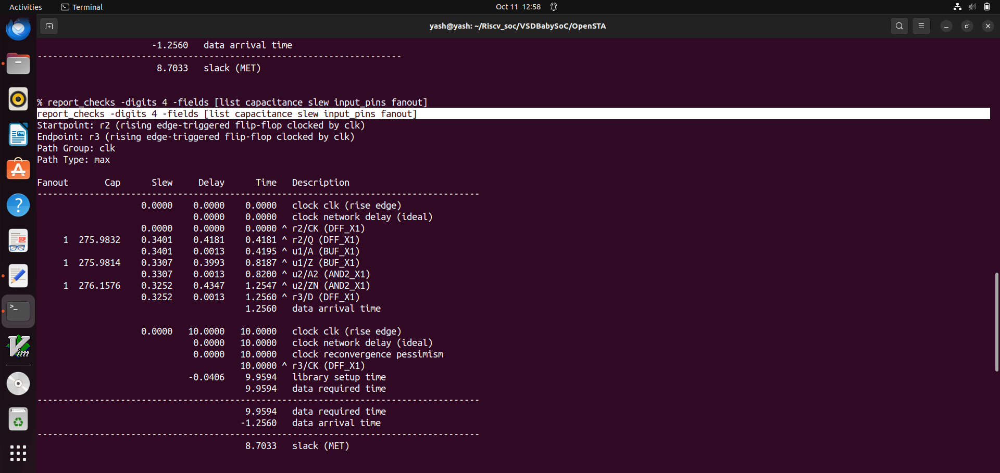
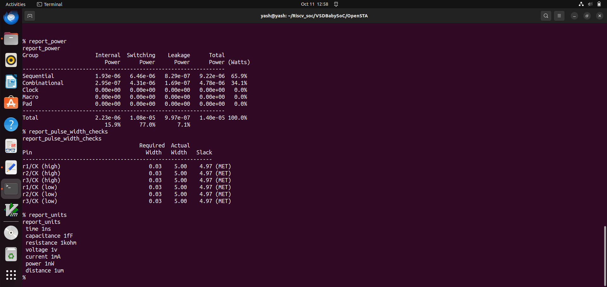

3️⃣ for ***nangate45_fast.lib.gz*** file
```shell
docker run -i -v $HOME:/data opensta
```
```shell
read_liberty /OpenSTA/examples/nangate45_typ.lib.gz
read_verilog /OpenSTA/examples/example1.v
link_design top
read_spef /OpenSTA/examples/example1.dspef
create_clock -name clk -period 10 {clk1 clk2 clk3}
set_input_delay -clock clk 0 {in1 in2}
report_checks
```
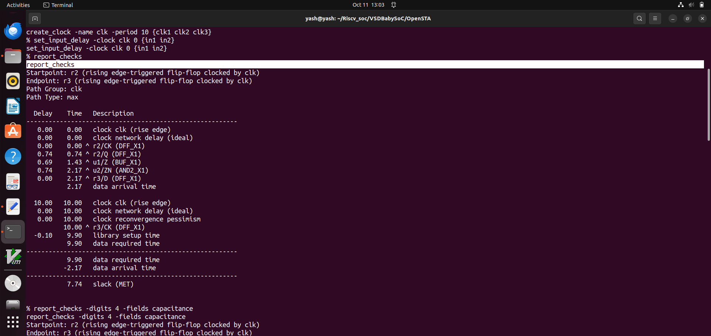

### more options to explore

```bash
report_checks -digits 4 -fields capacitance ## report capacitance per stage
report_checks -digits 4 -fields [list capacitance slew input_pins fanout]       ###Report Timing with Capacitance, Slew, Input Pins, and Fanout
report_power ### reort total and component power
report_pulse_width_checks ### report_pulse_width_check
report_units  ### report_units
```
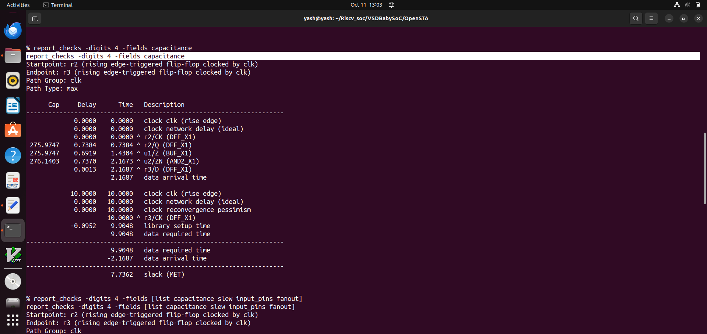
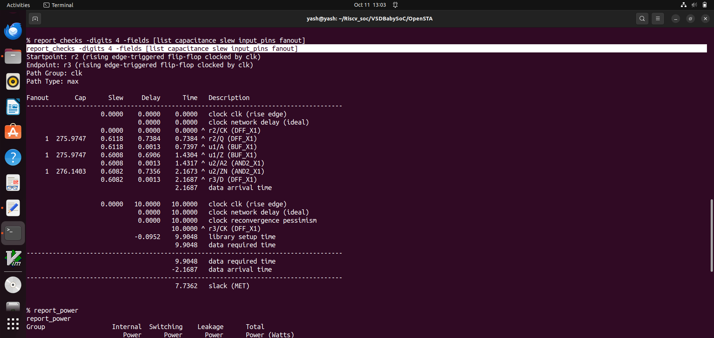
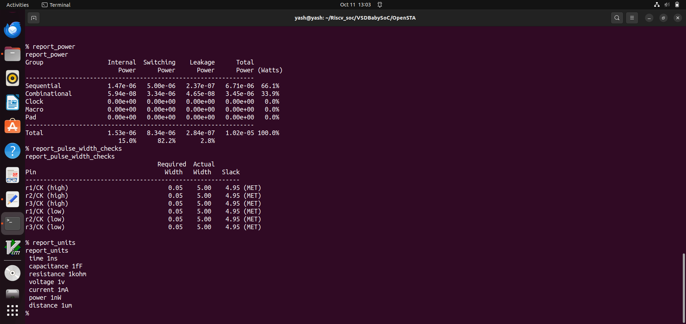

### Timing Analysis Using a TCL Script

To automate the timing flow, you can write the commands into a .tcl script and execute it from the OpenSTA shell.

**<ins>min_max_delays.tcl</ins>**
```bash
# Load liberty files for max and min analysis
read_liberty -max /data/Riscv_soc/VSDBabySoC/OpenSTA/examples/nangate45_slow.lib.gz
read_liberty -min /data/Riscv_soc/VSDBabySoC/OpenSTA/examples/nangate45_fast.lib.gz

# Read the gate-level Verilog netlist
read_verilog /data/Riscv_soc/VSDBabySoC/OpenSTA/examples/example1.v

# Link the top-level design
link_design top

# Define clocks and input delays
create_clock -name clk -period 10 {clk1 clk2 clk3}
set_input_delay -clock clk 0 {in1 in2}

# Generate a full min/max timing report
report_checks -path_delay min_max
```
| **Line of Code**                                     | **Purpose**             | **Explanation**                                                                          |
| ---------------------------------------------------- | ----------------------- | ---------------------------------------------------------------------------------------- |
| `read_liberty -max nangate45_slow.lib.gz`            | Load max delay library  | Loads the **slow corner Liberty file** for **setup (max delay)** analysis.               |
| `read_liberty -min nangate45_fast.lib.gz`            | Load min delay library  | Loads the **fast corner Liberty file** for **hold (min delay)** analysis.                |
| `read_verilog example1.v`                            | Load gate-level netlist | Reads the synthesized **Verilog netlist** of the design.                                 |
| `link_design top`                                    | Link design             | Links the netlist using `top` as the **top-level module**,connecting with Liberty cells  |
| `create_clock -name clk -period 10 {clk1 clk2 clk3}` | Create clock            | Defines a **clock named `clk`** with a 10 ns period on ports `clk1`, `clk2`, and `clk3`. |
| `set_input_delay -clock clk 0 {in1 in2}`             | Set input delay         | Applies **0 ns input delay** relative to `clk` for inputs `in1` and `in2`.               |
| `report_checks -path_delay min_max`                  | Run full STA            | Reports both **setup (max)** and **hold (min)** timing paths and checks.                 |


### Run the Script Using Docker

To run this script non-interactively using Docker:

```shell
docker run -it -v $HOME:/data opensta /data/Riscv_soc/VSDBabySoC/OpenSTA/examples/min_max_delays.tcl
```

🤔**Why use the full path?**

Inside the Docker container, your $HOME directory from the host system is mounted as /data.

_So a file located at `$HOME/VLSI/VSDBabySoC/OpenSTA/examples/min_max_delays.tcl` on your machine becomes accessible at `/data/VLSI/VSDBabySoC/OpenSTA/examples/min_max_delays.tcl` inside the container._

This absolute path ensures that OpenSTA can locate and execute the script correctly within the container's file system.

This method ensures repeatability and makes it easy to maintain reusable timing analysis setups for your designs.

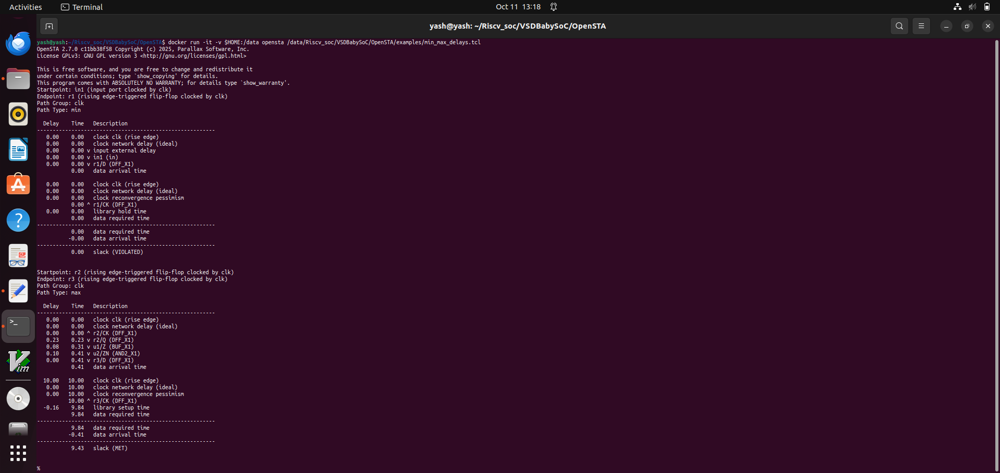

### VSDBabySoC basic timing analysis

#### Prepare Required Files

To begin static timing analysis on the VSDBabySoC design, you must organize and prepare the required files in specific directories.

```bash
# Create a directory to store Liberty timing libraries
yash@yash-VirtualBox:~/Riscv_soc/VSDBabySoC/OpenSTA$ mkdir -p examples/timing_libs/
yash@yash-VirtualBox:~/Riscv_soc/VSDBabySoC/OpenSTA/examples$ ls timing_libs/
avsddac.lib  avsdpll.lib  sky130_fd_sc_hd__tt_025C_1v80.lib
# Create a directory to store synthesized netlist and constraint files
yash@yash-VirtualBox:~/Riscv_soc/VSDBabySoC/OpenSTA$ mkdir -p examples/BabySoC
yash@yash-VirtualBox:~/Riscv_soc/VSDBabySoC/OpenSTA/examples$ ls BabySoC/
gcd_sky130hd.sdc vsdbabysoc_synthesis.sdc  vsdbabysoc.synth.v
```
These files include:

- Standard cell library: sky130_fd_sc_hd__tt_025C_1v80.lib

- IP-specific Liberty libraries: avsdpll.lib, avsddac.lib

- Synthesized gate-level netlist: vsdbabysoc.synth.v

- Timing constraints: vsdbabysoc_synthesis.sdc

Below is the TCL script to run complete min/max timing checks on the SoC:
```bash
# Load liberty files for max and min analysis
read_liberty -max /data/Riscv_soc/VSDBabySoC/OpenSTA/examples/nangate45_slow.lib.gz
read_liberty -min /data/Riscv_soc/VSDBabySoC/OpenSTA/examples/nangate45_fast.lib.gz

# Read the gate-level Verilog netlist
read_verilog /data/Riscv_soc/VSDBabySoC/OpenSTA/examples/example1.v

# Link the top-level design
link_design top

# Define clocks and input delays
create_clock -name clk -period 10 {clk1 clk2 clk3}
set_input_delay -clock clk 0 {in1 in2}

# Generate a full min/max timing report
report_checks -path_delay min_max
```
| **Line of Code**                                       | **Purpose**                | **Explanation**                                                                     |
| ------------------------------------------------------ | -------------------------- | ------------------------------------------------------------------------------------|
| `read_liberty -min ...sky130...` & `-max ...sky130...` | Load standard cell library | Loads the **typical PVT corner** for both min and max timing analysis.              |
| `read_liberty -min/-max avsdpll.lib`                   | Load PLL IP Liberty        | Includes Liberty timing views of the **PLL IP** used in the design.                 |
| `read_liberty -min/-max avsddac.lib`                   | Load DAC IP Liberty        | Includes Liberty timing views of the **DAC IP** used in the design.                 |
| `read_verilog vsdbabysoc.synth.v`                      | Load synthesized netlist   | Loads the gate-level Verilog netlist of the **VSDBabySoC** design.                  |
| `link_design vsdbabysoc`                               | Link top-level module      | Links the hierarchy using `vsdbabysoc` as the **top module** for timing analysis.   |
| `read_sdc vsdbabysoc_synthesis.sdc`                    | Load constraints           | Loads SDC file specifying **clock definitions, input/output delays, false path**    |
| `report_checks`                                        | Run timing analysis        | Generates a default **setup timing report**. Add `-path_delay min_max`              |

execute it inside the Docker container:

```shell
docker run -it -v $HOME:/data opensta /data/Riscv_soc/VSDBabySoC/OpenSTA/examples/BabySoC/vsdbabysoc_min_max_delays.tcl
```
⚠️ **Possible Error Alert**

You may encounter the following error when running the script:

```bash
Warning: /data/Riscv_soc/VSDBabySoC/OpenSTA/examples/timing_libs/sky130_fd_sc_hd__tt_025C_1v80.lib line 23, default_fanout_load is 0.0.
Warning: /data/Riscv_soc/VSDBabySoC/OpenSTA/examples/timing_libs/sky130_fd_sc_hd__tt_025C_1v80.lib line 1, library sky130_fd_sc_hd__tt_025C_1v80 already exists.
Warning: /data/Riscv_soc/VSDBabySoC/OpenSTA/examples/timing_libs/sky130_fd_sc_hd__tt_025C_1v80.lib line 23, default_fanout_load is 0.0.
Error: /data/Riscv_soc/VSDBabySoC/OpenSTA/examples/timing_libs/avsdpll.lib line 54, syntax error
```

✅ **Fix:**

This error occurs because Liberty syntax does not support // for single-line comments, and more importantly, the { character appearing after // confuses the Liberty parser. Specifically, check around _line 54 of avsdpll.lib_ and correct any syntax issues such as:

```shell
//pin (GND#2) {
//  direction : input;
//  max_transition : 2.5;
//  capacitance : 0.001;
//}
```
✔️ **Replace with:**
```shell
/*
pin (GND#2) {
  direction : input;
  max_transition : 2.5;
  capacitance : 0.001;
}
*/
```
This should allow OpenSTA to parse the Liberty file without throwing syntax errors.

After fixing the Liberty file comment syntax as shown above, you can rerun the script to perform complete timing analysis for VSDBabySoC:


### VSDBabySoC PVT Corner Analysis (Post-Synthesis Timing)
Static Timing Analysis (STA) is performed across various **PVT (Process-Voltage-Temperature)** corners to ensure the design meets timing requirements under different conditions.

### Critical Timing Corners

**Worst Max Path (Setup-critical) Corners:**
- `ss_LowTemp_LowVolt`
- `ss_HighTemp_LowVolt`  
_These represent the **slowest** operating conditions._

**Worst Min Path (Hold-critical) Corners:**
- `ff_LowTemp_HighVolt`
- `ff_HighTemp_HighVolt`  
_These represent the **fastest** operating conditions._

 **Timing libraries** required for this analysis can be downloaded from:  
🔗 [Skywater PDK - sky130_fd_sc_hd Timing Libraries](https://github.com/efabless/skywater-pdk-libs-sky130_fd_sc_hd/tree/master/timing)

Below is the script that can be used to perform STA across the PVT corners for which the Sky130 Liberty files are available.
```bash
# List of standard cell liberty files
set list_of_lib_files(1) "sky130_fd_sc_hd__tt_025C_1v80.lib"
set list_of_lib_files(2) "sky130_fd_sc_hd__ff_100C_1v65.lib"
set list_of_lib_files(3) "sky130_fd_sc_hd__ff_100C_1v95.lib"
set list_of_lib_files(4) "sky130_fd_sc_hd__ff_n40C_1v56.lib"
set list_of_lib_files(5) "sky130_fd_sc_hd__ff_n40C_1v65.lib"
set list_of_lib_files(6) "sky130_fd_sc_hd__ff_n40C_1v76.lib"
set list_of_lib_files(7) "sky130_fd_sc_hd__ss_100C_1v40.lib"
set list_of_lib_files(8) "sky130_fd_sc_hd__ss_100C_1v60.lib"
set list_of_lib_files(9) "sky130_fd_sc_hd__ss_n40C_1v28.lib"
set list_of_lib_files(10) "sky130_fd_sc_hd__ss_n40C_1v35.lib"
set list_of_lib_files(11) "sky130_fd_sc_hd__ss_n40C_1v40.lib"
set list_of_lib_files(12) "sky130_fd_sc_hd__ss_n40C_1v44.lib"
set list_of_lib_files(13) "sky130_fd_sc_hd__ss_n40C_1v76.lib"

# Read custom libs first
read_liberty /data/Riscv_soc/VSDBabySoC/OpenSTA/examples/timing_libs/avsdpll.lib
read_liberty /data/Riscv_soc/VSDBabySoC/OpenSTA/examples/timing_libs/avsddac.lib

# make STA_OUTPUT directory
exec mkdir -p /data/Riscv_soc/VSDBabySoC/OpenSTA/examples/BabySoC/STA_OUTPUT

# Loop over standard cell libraries
for {set i 1} {$i <= [array size list_of_lib_files]} {incr i} {

    read_liberty /data/Riscv_soc/VSDBabySoC/OpenSTA/examples/timing_libs/$list_of_lib_files($i)
    read_verilog /data/Riscv_soc/VSDBabySoC/OpenSTA/examples/BabySoC/vsdbabysoc.synth.v
    link_design vsdbabysoc
    current_design
    read_sdc /data/Riscv_soc/VSDBabySoC/OpenSTA/examples/BabySoC/vsdbabysoc_synthesis.sdc

    check_setup -verbose

    report_checks -path_delay min_max -fields {nets cap slew input_pins fanout} -digits {4} \
        > /data/Riscv_soc/VSDBabySoC/OpenSTA/examples/BabySoC/STA_OUTPUT/min_max_$list_of_lib_files($i).txt

    exec echo "$list_of_lib_files($i)" >> /data/Riscv_soc/VSDBabySoC/OpenSTA/examples/BabySoC/STA_OUTPUT/sta_worst_max_slack.txt
    report_worst_slack -max -digits {4} >> /data/Riscv_soc/VSDBabySoC/OpenSTA/examples/BabySoC/STA_OUTPUT/sta_worst_max_slack.txt

    exec echo "$list_of_lib_files($i)" >> /data/Riscv_soc/VSDBabySoC/OpenSTA/examples/BabySoC/STA_OUTPUT/sta_worst_min_slack.txt
    report_worst_slack -min -digits {4} >> /data/Riscv_soc/VSDBabySoC/OpenSTA/examples/BabySoC/STA_OUTPUT/sta_worst_min_slack.txt

    exec echo "$list_of_lib_files($i)" >> /data/Riscv_soc/VSDBabySoC/OpenSTA/examples/BabySoC/STA_OUTPUT/sta_tns.txt
    report_tns -digits {4} >> /data/Riscv_soc/VSDBabySoC/OpenSTA/examples/BabySoC/STA_OUTPUT/sta_tns.txt

    exec echo "$list_of_lib_files($i)" >> /data/Riscv_soc/VSDBabySoC/OpenSTA/examples/BabySoC/STA_OUTPUT/sta_wns.txt
    report_wns -digits {4} >> /data/Riscv_soc/VSDBabySoC/OpenSTA/examples/BabySoC/STA_OUTPUT/sta_wns.txt
}
```
execute it inside the Docker container:

```bash
docker run -it -v $HOME:/data opensta /data/Riscv_soc/VSDBabySoC/OpenSTA/examples/BabySoC/sta_across_pvt.tcl
```

After executing the above script, you can find the generated timing reports in the STA_OUTPUT directory:

```bash
yash@yash-VirtualBox:~/Riscv_soc/VSDBabySoC/OpenSTA/examples/BabySoC/STA_OUTPUT$ ls
min_max_sky130_fd_sc_hd__ff_100C_1v65.lib.txt  min_max_sky130_fd_sc_hd__ss_100C_1v40.lib.txt  min_max_sky130_fd_sc_hd__ss_n40C_1v44.lib.txt  sta_worst_max_slack.txt
min_max_sky130_fd_sc_hd__ff_100C_1v95.lib.txt  min_max_sky130_fd_sc_hd__ss_100C_1v60.lib.txt  min_max_sky130_fd_sc_hd__ss_n40C_1v76.lib.txt  sta_worst_min_slack.txt
min_max_sky130_fd_sc_hd__ff_n40C_1v56.lib.txt  min_max_sky130_fd_sc_hd__ss_n40C_1v28.lib.txt  min_max_sky130_fd_sc_hd__tt_025C_1v80.lib.txt
min_max_sky130_fd_sc_hd__ff_n40C_1v65.lib.txt  min_max_sky130_fd_sc_hd__ss_n40C_1v35.lib.txt  sta_tns.txt
min_max_sky130_fd_sc_hd__ff_n40C_1v76.lib.txt  min_max_sky130_fd_sc_hd__ss_n40C_1v40.lib.txt  sta_wns.txt
```

| **File**                  | **Description**                                                     |
| ------------------------- | ------------------------------------------------------------------- |
| `min_max_<lib>.txt`       | Detailed timing report for setup and hold paths for each PVT corner |
| `sta_worst_max_slack.txt` | Worst setup slack values across all corners                         |
| `sta_worst_min_slack.txt` | Worst hold slack values across all corners                          |
| `sta_tns.txt`             | Total negative slack values across all corners                      |
| `sta_wns.txt`             | Worst negative slack values across all corners                      |

### 📈Timing Plots Across PVT Corners

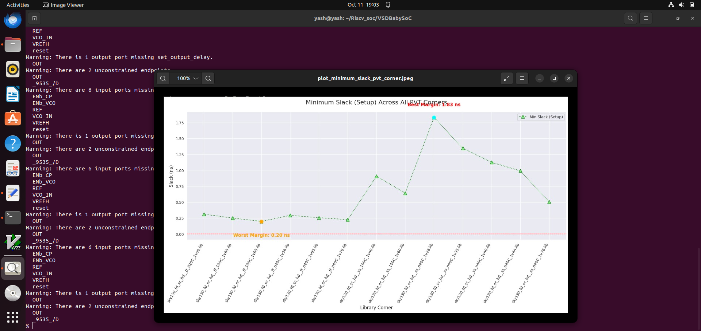
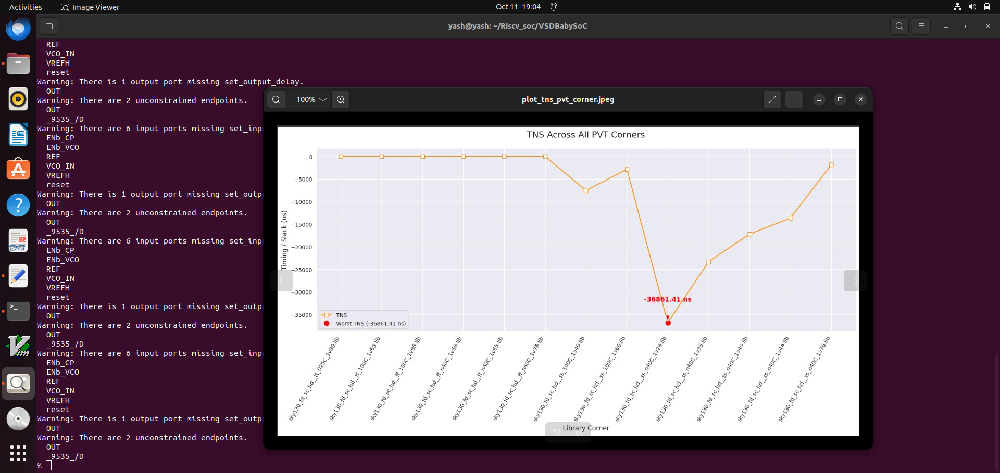
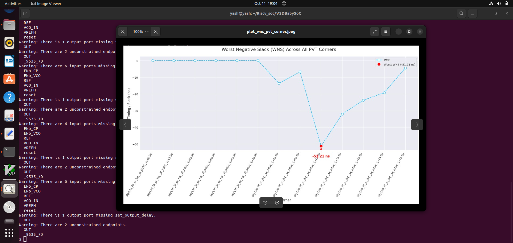
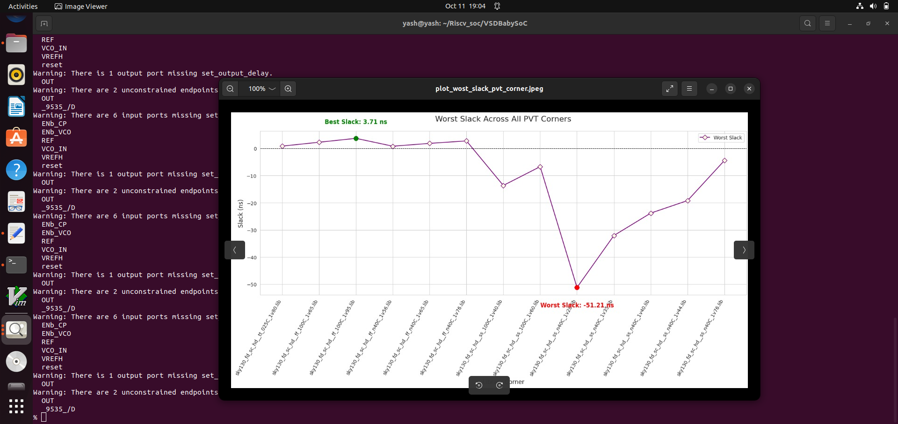


