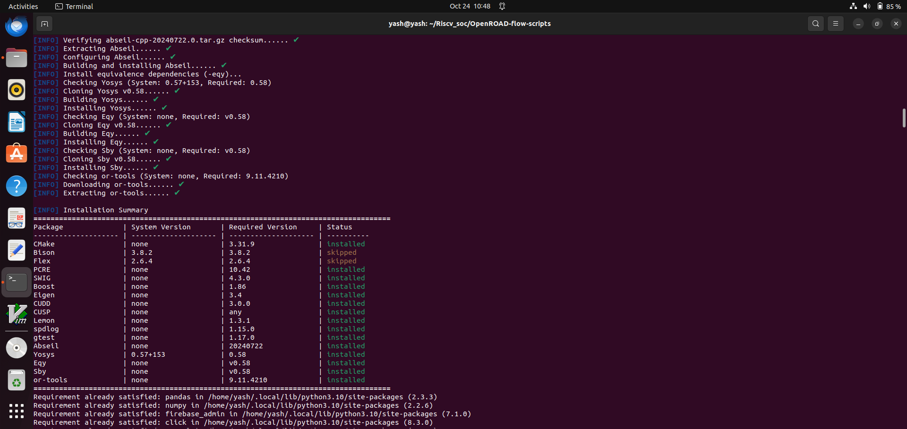
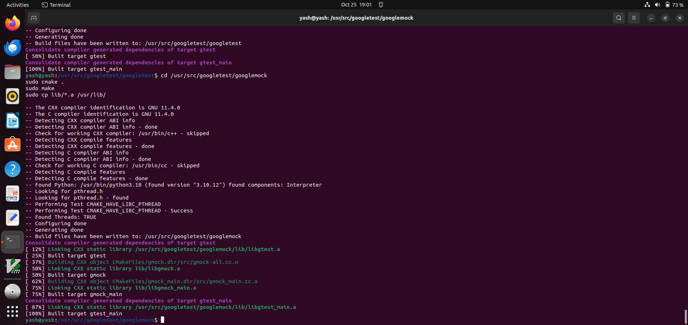
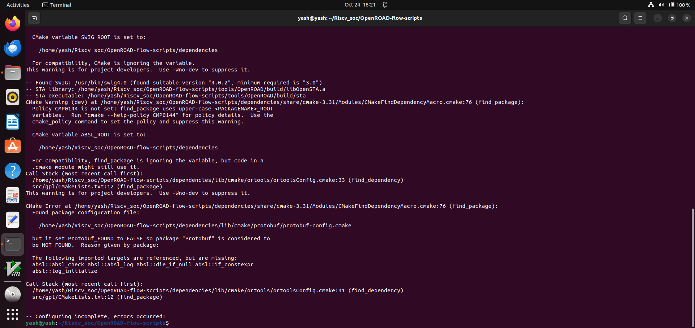

# Week 5 Task – OpenROAD Flow Setup and Floorplan + Placement 

## Objective 
--> To set up the OpenROAD Flow Scripts environment and execute the Floorplan and Placement stages of the physical design flow. This task transitions you from SPICE-level transistor design (Week 4) to backend implementation, where logic is converted into an actual physical layout.

##  What is OpenROAD?

**OpenROAD** is an open-source, fully automated **RTL-to-GDSII flow** for digital IC design. It transforms your hardware description into actual silicon layout through synthesis, floorplanning, placement, clock tree synthesis, routing, and final layout generation.


## 📂 Understanding ORFS Directory Structure

### 🗂️ Root Level Organization
```plaintext
OpenROAD-flow-scripts/
├── 🐳 docker/          → Docker-based installation & run scripts
├── 📚 docs/            → Complete documentation
├── ⚡ flow/            → Core RTL-to-GDS flow files
├── 🧪 jenkins/         → Regression tests for builds
├── 🛠️ tools/           → Required tools for the flow
├── ⚙️ etc/             → Dependency installers
└── 📌 setup_env.sh     → Environment configuration script
```

### 📁 Inside `flow/` Directory
```plaintext
flow/
├── 🎨 designs/         → Built-in design examples across technology nodes
├── 📝 Makefile         → Automated flow execution
├── 🏭 platforms/       → Technology libraries (LEF, GDS, etc.)
├── 📖 tutorials/       → Learning resources
├── 🔧 util/            → Utility scripts
└── 📜 scripts/         → Flow automation scripts
```

---

## 🚀 Installation Flow

### Step 1: Clone the Repository
```bash
git clone --recursive https://github.com/The-OpenROAD-Project/OpenROAD-flow-scripts
cd OpenROAD-flow-scripts
```

### Step 2: Run Setup Script
```bash
sudo ./setup.sh
```

### Step 3: Build OpenROAD
```bash
./build_openroad.sh --local
```

### Step 4: Verify Installation
```bash
source ./env.sh
yosys -help  
openroad -help
```

### Terminal output photos





### error :
now error is occured but i didn't find the actual reson behind this so as soon as i resolve my error i update my githubrepo.

### error photo:

### Step 5: Execute Floorplan + Placement️
```bash
cd flow
make
```

🎯 What Happens Here:
-  Floorplan Stage:** Defines core area, die dimensions, I/O placement
-  Placement Stage:** Arranges standard cells to minimize delay & congestion

### Step 6: Visualize Results in GUI
```bash
make gui_final
```

## 1. Floorplanning

**Definition:**  
Floorplanning is the process of **defining the macro layout of a chip** at a high level, including placement of **large blocks (IP blocks, memories, macros)**, **I/O pads**, and approximate wiring areas.

**Key Objectives:**
- Optimize **chip area**.
- Minimize **interconnect (wire) length**.
- Ensure **routing feasibility**.
- Maintain **timing constraints** for critical paths.

**Key Components:**
- **Macros/IP Blocks:** Large pre-designed blocks (e.g., SRAM, processor cores).
- **Core Area:** Region where standard cells will be placed.
- **I/O Pads:** Pads for external connections.
- **Aspect Ratio & Utilization:** Shape and density control.

**Learning Points:**
- Floorplanning reduces routing congestion later.
- Helps estimate **chip area, aspect ratio, and wirelength** early.
- Tools like OpenROAD, Cadence Innovus, and Synopsys IC Compiler provide **automatic floorplanning**.

---

## 2. Placement

**Definition:**  
Placement is the step where **standard cells are assigned exact physical coordinates** within the floorplanned regions, optimizing for **timing, power, and routability**.

**Key Objectives:**
- Minimize **total wirelength** (global and local).
- Meet **timing constraints** (critical path delay).
- Avoid **cell overlap** and **congestion**.
- Optimize for **power and signal integrity**.

**Types of Placement:**
- **Global Placement:** Rough positioning to reduce overall wirelength and congestion.
- **Detailed Placement:** Fine-tuning to legalize cell positions and meet design rules.

**Learning Points:**
- Placement is more fine-grained than floorplanning.
- Tools use **analytical (quadratic/canonical) or combinatorial algorithms**.
- Placement directly impacts **timing closure** and **final chip performance**.

---

## 3. Relationship Between Floorplanning and Placement
| Aspect             | Floorplanning                        | Placement                          |
|-------------------|-------------------------------------|-----------------------------------|
| Level             | Macro-level                         | Standard cell level               |
| Objective         | Area, macro positioning, wire estimates | Exact coordinates, timing, congestion |
| Tools             | OpenROAD, Innovus, ICC              | OpenROAD, RePlAce, Cadence tools  |
| Output            | Approximate block locations         | Exact cell coordinates             |

---

## 4. Key Learnings
- Floorplanning sets the **foundation** for a feasible and optimized chip layout.
- Placement ensures **timing, power, and area goals** are met at the cell level.
- Both are iterative — changes in floorplan often require re-placement.
- **Wirelength, congestion, timing, and design rules** are always optimized together.
- Tools like **OpenROAD** provide an automated flow from floorplan → placement → routing.

---

